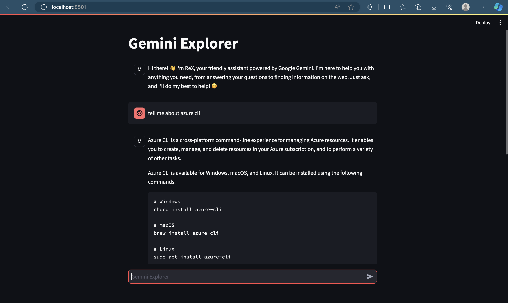

# Gemini Explorer

## Overview

- This Streamlit application showcases the capabilities of the Google Gemini language model through an interactive chat interface. Engage in conversations, ask questions, and explore its ability to generate text, translate languages, write different kinds of creative content, and answer your questions in an informative way.



## Usage

- Clone this repository.
- Install the required dependencies:

  ```Bash
    pip install streamlit vertexai
    ```

- Run the application:

    ```Bash
    streamlit run gemini_explorer.py
    ```

- Access the application in your web browser.
- Type your message in the chat box and press enter.
- Read the model's response and continue the conversation.

## Key Features

- Leverages the advanced capabilities of the Gemini generative model.
- Provides a user-friendly chat interface powered by Streamlit.
- Maintains a persistent chat history for context.
- Handles varying text lengths and multiple parts for comprehensive responses.
- Offers potential for customization and extensions.

## Additional Notes

- Requires a Vertex AI project with access to the Gemini model.
- Model configuration can be adjusted for different generative behaviors.
